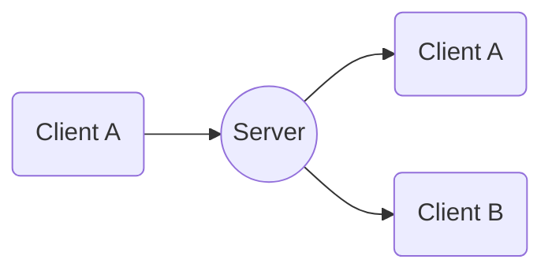

# EnetLobby

Language: GDScript
Renderer: GLES 2

  

## Goals

This project is meant only to demonstrate
- How to manage a lobby with peer matching
- How to assign and manage room entries
- How to connect two peers automatically

Follows the (client-server-client) communication model.
Whenever a change is made by a peer, the **Server** is notified.
Then the **Server** notifies all related peers through an `rpc` call

Pros:
- Nothing happens without the **Server**'s knowledge
- Only **Server** keeps record of each peer's information

Cons:
- Peers will only directly communicate with the ones in same room
- If **Server** goes offline during critical point no way to resume
- Less flexibility when options are changed
- Peers are not aware of all other peers

## Operation
To use/test on either the same machine with localhost or multiple devices on the same network.
- Run one instance as Server using the **Host** button 
- Then run multiple instances using the **Join** button

Alternatively
- Run two instances then select Auto and using the **Search** button each instance will try to locate the other using a `udp_peer` the faster of the too becoming the server.
> **Note:** This is achieved using ipv4 broadcasts.
> The Tv did not replace the book and the PC did not replace the Tv, broadcast may be old compared to ipv6's multicast but it still works.

